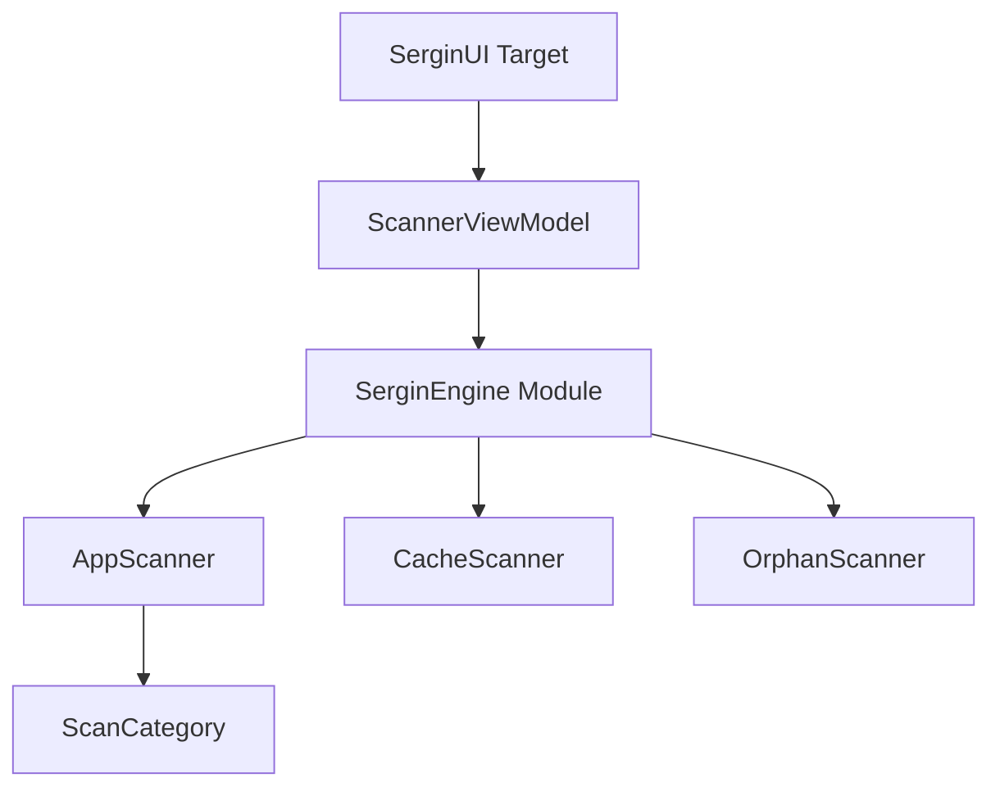

# Sergin 🚀
> **Native, High-Performance macOS Residual Scanner & App Uninstaller**

[](https://developer.apple.com/macos/)
[](https://developer.apple.com/swift/)
[](LICENSE)

**Sergin** is a modern, lightweight, and native macOS utility designed to intelligently hunt down and safely delete deeply hidden application residual files that standard dragging-to-trash leaves behind. It matches the scanning depth of utilities like *AppCleaner* while maintaining a completely native SwiftUI interface, safe sandbox elevation fallbacks, and real-time APFS allocated size calculations.

---

## Key Features 🌟

* 🔍 **Smart Search Suggestion Bar:** Instantly indexes all installed third-party applications. Search and select any app dynamically to initiate a target residual scan.
* 📦 **Drag & Drop Interactive Zone:** Drag any `.app` bundle from your Finder or Desktop directly onto the dashboard to parse its details and scan for residual files.
* 📂 **Heuristic Residual Search Engine:**
  * Extracts custom vendor prefixes (e.g., `us.zoom` for `us.zoom.xos`) and searches for related files (like daemons, launch agents, and helpers) while blacklisting generic domains (`com.google`, `com.apple`) to guarantee absolute safety.
  * Deep-scans nested directories (e.g. locating `Application Support/Google/Chrome` automatically when targeting Chrome).
* ⚙️ **System-wide Sweepers:**
  * **Orphan Finder:** Discovers leftover directories of apps that have already been deleted.
  * **Cache Cleaner:** Pinpoints and permanently deletes redundant folders in `~/Library/Caches` to reclaim gigabytes of disk space instantly.
* 💾 **APFS Size-on-Disk Precision:** Uses native macOS `.totalFileAllocatedSizeKey` measurements to represent actual physical storage reclaimed (accounting for 4KB block allocations), ensuring Sergin matches macOS Finder down to the byte.
* 🛡️ **Privilege Elevation Safeguards:** Employs osascript admin authentication fallbacks to remove sandboxed files (`~/Library/Containers`) and repairs file permissions (`chown -R`) so that moved files immediately show up in the Finder Trash.

---

## UI Aesthetics 🎨

Sergin is styled to look and feel like a premium macOS utility:
* **Glassmorphic Material Design:** Uses native macOS control background materials with responsive dark/light mode integration.
* **Surgical Controls:** Files are elegantly categorized (e.g., *Launch Agents*, *Preferences*, *Support Files*) with distinct SF Symbols and status toggles.
* **Contextual Actions:** The primary action button dynamically switches labels between **"Move to Trash"** (for leftovers) and **"Delete Permanently"** (for cache files) depending on your selection.

---

## Technical Architecture ⚙️

Sergin is built as a Swift Package Manager project with a modular architecture:



### Module Breakdown:
1. **`SerginUI`**: The SwiftUI macOS executable defining the user interface targets.
2. **`SerginCLI`**: A CLI executable utility allowing you to scan for bundle IDs directly from the terminal.
3. **`SerginEngine`**: The core library containing our asynchronous scanners and file-system helpers.

---

## Directory Layout 📂

* `SerginEngine/` - The core Swift Package Manager container.
  * `Sources/SerginEngine/` - Scanning algorithms, category pathways, and data models.
  * `Sources/SerginUI/` - The main SwiftUI App, views (`ContentView`, `ResultsView`), and view models.
  * `Sources/SerginCLI/` - Standard command-line tool interface.
  * `build_dmg.sh` - Automated production compiler and packaging shell script.
* `Sergin_UX_Documentation.md` - Deep-dive project specifications and sandboxing safety documentation.

---

## Getting Started & Compiling 🛠️

### Prerequisites:
* macOS 13 Ventura or newer.
* Xcode Command Line Tools (`swift` compiler version 6.0+).

### Building from Command Line:
Navigate to the `SerginEngine` directory:
```bash
cd SerginEngine
swift build -c release
```

### Run the CLI Tool:
You can perform bundle scans directly from your shell:
```bash
swift run SerginCLI com.spotify.client
```

### Packaging into a signed `.app` & `.dmg` 📦
To generate a distributable, ad-hoc codesigned macOS disk image complete with custom high-resolution application icons:
1. Verify the `build_dmg.sh` paths match your environment.
2. Run the packaging script:
   ```bash
   chmod +x build_dmg.sh
   ./build_dmg.sh
   ```
3. Your compiled and signed installer image (`Sergin.dmg`) will be exported directly to your **Desktop**.

---

## License 📄
This project is licensed under the MIT License. See the [LICENSE](LICENSE) file for details.
